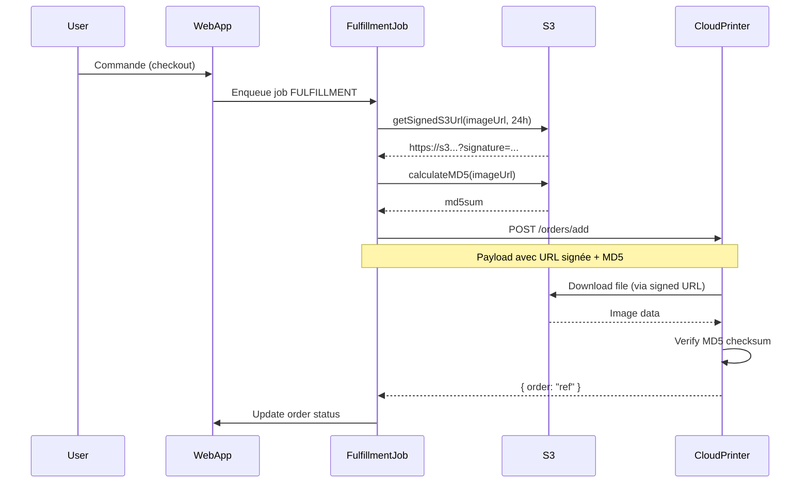

# 🔧 Corrections Finales - Fulfillment CloudPrinter & Auth

## Problèmes Identifiés

### 1. ❌ Erreur JWT : "no matching decryption secret"

**Cause** : Cookies d'authentification créés avec l'ancien `NEXTAUTH_SECRET`

**Solution** : Effacer les cookies du navigateur

**Voir** : [`docs/JWT_FIX.md`](JWT_FIX.md) pour les instructions détaillées

### 2. ❌ Images S3 en 403

```
⨯ upstream image response failed for https://s3.aleou.app/muzo-uploads-dev/... 403
```

**Cause** : URLs S3 non-signées, accès refusé

**Solution** : Utilisation de **Pre-Signed URLs** (URLs signées avec accès temporaire)

### 3. ❌ CloudPrinter ne peut pas télécharger les fichiers

**Cause** : CloudPrinter essaie de télécharger depuis des URLs S3 publiques (bloquées)

**Solution** : Génération d'URLs signées valides 24h pour CloudPrinter

## Corrections Appliquées

### packages/fulfillment/src/utils/s3.ts

**Ajout** : Fonction `getSignedS3Url()`

```typescript
/**
 * Get a signed URL for S3 object (for secure access)
 */
export async function getSignedS3Url(
  url: string, 
  options: { expiresIn?: number } = {}
): Promise<string> {
  // Extract S3 key from URL
  const key = extractS3KeyFromUrl(url);
  
  // Generate signed URL valid for 1h (default) or custom duration
  const client = getS3Client();
  const command = new GetObjectCommand({ Bucket: bucket, Key: key });
  const signedUrl = await awsGetSignedUrl(client, command, {
    expiresIn: options.expiresIn ?? 3600, // Default 1 hour
  });
  
  return signedUrl;
}
```

**Pourquoi** : CloudPrinter a besoin d'une URL accessible par HTTPS pour télécharger le fichier

### packages/fulfillment/src/providers/cloudprinter.ts

**Avant** :
```typescript
const filesWithMD5 = await Promise.all(
  order.files.map(async (file) => {
    const md5sum = await calculateMD5FromS3Url(file.url);
    return {
      type: 'product' as const,
      url: file.url, // ❌ URL publique (403)
      md5sum,
    };
  })
);
```

**Après** :
```typescript
const filesWithMD5 = await Promise.all(
  order.files.map(async (file) => {
    // ✅ Get a long-lived signed URL (24 hours)
    const signedUrl = await getSignedS3Url(file.url, { expiresIn: 86400 });
    const md5sum = await calculateMD5FromS3Url(file.url);
    return {
      type: 'product' as const,
      url: signedUrl, // ✅ URL signée (accessible)
      md5sum,
    };
  })
);
```

**Amélioration** : Meilleure référence unique pour les items

```typescript
// Avant
reference: `item-${index + 1}`, // Peut causer des doublons

// Après
reference: `${order.orderId}-item-${index + 1}`, // ✅ Unique par commande
```

### packages/cloudprinter/src/types.ts

**Ajout** : Support du type "box" pour les puzzles

```typescript
export const CreateOrderItemFileSchema = z.object({
  type: z.enum(["product", "cover", "book", "box"]), // ✅ Ajout de "box"
  url: z.string(),
  md5sum: z.string(),
});
```

**Pourquoi** : Les puzzles CloudPrinter nécessitent DEUX fichiers :
- `type: "product"` - Image sur le puzzle
- `type: "box"` - Image sur la boîte

### packages/fulfillment/package.json

**Ajout** : Dépendance manquante

```json
{
  "dependencies": {
    "@aws-sdk/client-s3": "^3.914.0",
    "@aws-sdk/s3-request-presigner": "^3.914.0" // ✅ Nouveau
  }
}
```

## Flux CloudPrinter Complet



## Vérification

### 1. Effacer les Cookies

Chrome/Edge :
1. F12 → Application → Cookies → localhost:3000
2. Clear all
3. F5

### 2. Tester la Commande

```bash
# Démarrer le projet
pnpm run dev

# Dans le navigateur :
# 1. Se connecter
# 2. Créer un projet
# 3. Commander un puzzle
# 4. Vérifier les logs
```

### 3. Logs Attendus

**✅ Sans Erreur** :
```json
{"name":"muzo-cloudprinter","msg":"Preparing files with signed URLs and MD5 checksums"}
{"name":"muzo-cloudprinter","msg":"File prepared with signed URL and MD5"}
{"name":"muzo-cloudprinter","msg":"Sending order to CloudPrinter"}
{"name":"muzo-cloudprinter","msg":"CloudPrinter order created successfully"}
```

**❌ Avec Erreur** (avant fix) :
```
upstream image response failed for https://s3.aleou.app/... 403
```

## Structure de Commande CloudPrinter

```json
{
  "reference": "68f8957f16c2f4fb009725d3",
  "email": "orders@muzo.app",
  "addresses": [{
    "type": "delivery",
    "firstname": "John",
    "lastname": "Doe",
    "street1": "19 Rue Beaurepaire",
    "city": "Paris",
    "zip": "75010",
    "country": "FR",
    "phone": "+33123456789",
    "email": "customer@muzo.app"
  }],
  "items": [{
    "reference": "68f8957f16c2f4fb009725d3-item-1",
    "product": "puzzle_30x40_1000pcs",
    "shipping_level": "cp_ground",
    "title": "Puzzle Photo MUZO",
    "count": "1",
    "options": [
      { "type": "puzzle_box_printed_373x273x56_mm", "count": "1" },
      { "type": "puzzle_cardboard", "count": "1" }
    ],
    "files": [
      {
        "type": "product",
        "url": "https://s3.aleou.app/...?X-Amz-Signature=...",
        "md5sum": "4578c3ecf64e47581b175d542f8b0160"
      },
      {
        "type": "box",
        "url": "https://s3.aleou.app/...?X-Amz-Signature=...",
        "md5sum": "4578c3ecf64e47581b175d542f8b0160"
      }
    ]
  }]
}
```

## Points Clés

1. **URLs Signées** : Valides 24h pour que CloudPrinter ait le temps de télécharger
2. **MD5 Checksum** : CloudPrinter vérifie l'intégrité du fichier téléchargé
3. **Type "box"** : Spécifique aux puzzles avec boîte imprimée
4. **Reference Unique** : `${orderId}-item-${index}` évite les doublons

## Prochaines Étapes

- [ ] Tester une commande complète
- [ ] Vérifier que CloudPrinter reçoit bien le fichier
- [ ] Suivre le statut de la commande avec `client.orders.get(reference)`
- [ ] Implémenter le suivi de livraison (tracking)

## Documentation

- **JWT Fix** : [`docs/JWT_FIX.md`](JWT_FIX.md)
- **CloudPrinter API** : https://www.cloudprinter.com/docs
- **AWS S3 Pre-Signed URLs** : https://docs.aws.amazon.com/AmazonS3/latest/userguide/PresignedUrlUploadObject.html
